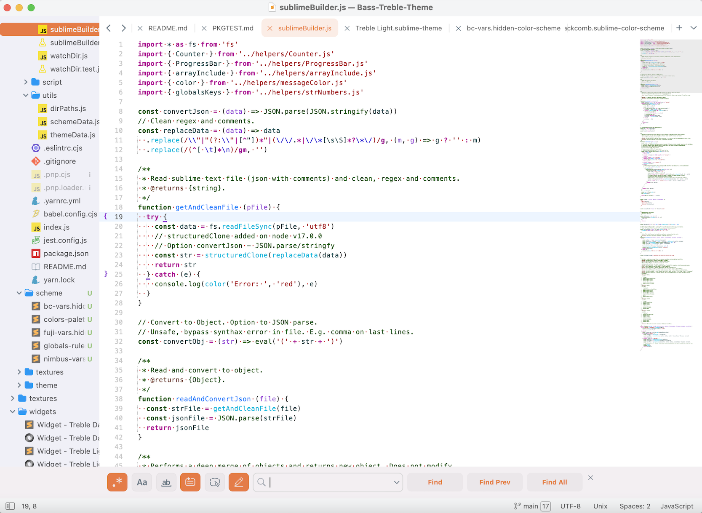

## Repository and files/folders renamed

https://docs.github.com/en/repositories/creating-and-managing-repositories/renaming-a-repository
```
$ git remote set-url origin https://github.com/53v3n3d4/Zukan-Icon-Theme.git


```

Files and folders that has been renamed, or is going to be, in version v0.2.0.
| previous | new |
|-----------|------|
| file_type_(name).tmPreferences | (name).tmPreferences  |
| file_type_(name).svg | (name).svg  |
| file_type_(name).png | (name).png  |
| /aliases | /icons_syntaxes |

## Zukan Icon Theme


> Icons from v0.1.0

This is a slow work in progress (WIP).  

Icons themes for Sublime Text editor.  

This package uses tmPreferences and sublime-syntax files.  

## Theme



Currently, only Treble theme suported.  

- [Treble Adaptive](https://github.com/53v3n3d4/file-type-icons/blob/main/icons/Treble%20Adaptive.sublime-theme)
- [Treble Dark](https://github.com/53v3n3d4/file-type-icons/blob/main/icons/Treble%20Dark.sublime-theme)
- [Treble Light](https://github.com/53v3n3d4/file-type-icons/blob/main/icons/Treble%20Light.sublime-theme)

To add new theme:
- Duplicate one of the Treble files above inside icons folder
- Rename it with new theme name, e.g. Default.sublime-theme
- Maybe restart needed

If your theme do not have settings for icon_file_type, the settings below has a hover and select effects.
```
[
  {
    "class": "icon_file_type",
    "layer0.tint": null,
    "layer0.opacity": 0.8,
    "content_margin": [9, 8]
  },
  {
    "class": "icon_file_type",
    "parents": [{"class": "tree_row", "attributes": ["hover"]}],
    "layer0.opacity": 0.6
  },
  {
    "class": "icon_file_type",
    "parents": [{"class": "tree_row", "attributes": ["selected"]}],
    "layer0.opacity": 1.0
  }
]
```

If your theme does have setting for icon_file_type, the setting below is enough.  
```
[
  {
    "class": "icon_file_type",
    "layer0.tint": null,
    "content_margin": [9, 8]
  }
]
```

## Install

The only way to install this icons now is manually.

To install manually,
- Download the [latest release](https://github.com/53v3n3d4/file-type-icons/releases) or clone this repo.
- Menu `Sublime Text > Preferences > Browse packages...` to open destination folder
- Then unzip `file-type-icons zip file` inside `Packages` folder. Or clone the repo inside `Packages`folder.

## Uninstall

To uninstall manually, go to your Sublime Text folder.
- Menu `Sublime Text > Preferences > Browse packages...`
- Then delete `file-type-icons` inside `Packages` folder

## Icons that works depending on folder position

- Poetry  
- Svg  
- sublime-theme, sublime-color-scheme, sublime-settings... mostly sublime (Exceptions like `hidden-theme` works not depending on this condition)  

## Icons that do not work

- Photoshop. It is using image icon
- XML. It is using markup icon  

## Notes
- This package uses tmPreferences and sublime-syntax files, it is heavily based on how [`A File Icon`](https://github.com/SublimeText/AFileIcon) package make icons work  
- `file-type-icons` is old project name  
- If rename `file-type-icons` to `v-file-type-icons`, and make the last folder in `Packages` directory, sublime icons will work
- If rename `file-type-icons` to `z-file-type-icons`, and make the last folder in `Packages` directory, is not enough for svg icon to work. It was needed `zz-file-type-icons` to make svg icon work

## File icon packages :alien:

- [A File Icon](https://github.com/SublimeText/AFileIcon)
- [FileIcons](https://github.com/braver/FileIcons)

## License

MIT license ([LICENSE-MIT](LICENSE))