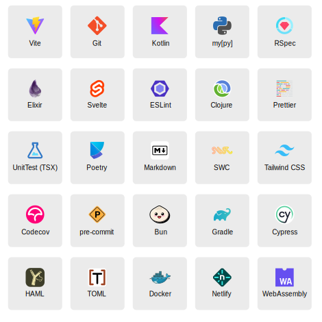

## Repository and files/folders renamed

https://docs.github.com/en/repositories/creating-and-managing-repositories/renaming-a-repository
```
$ git remote set-url origin https://github.com/53v3n3d4/Zukan-Icon-Theme.git


```

Files and folders that has been renamed, or is going to be, in version v0.2.0.
| previous | new |
|-----------|------|
| file_type_(name).tmPreferences | (name).tmPreferences  |
| file_type_(name).svg | (name).svg  |
| file_type_(name).png | (name).png  |
| /aliases | /icons_syntaxes |
| /preferences | /icons_preferences |

## Zukan Icon Theme

This is a slow work in progress (WIP).  

Icon theme for Sublime Text editor.  




> File icons from v0.2.0


## Install

The only way to install this icons now is manually.  

To install manually,  
- Download the [latest release](https://github.com/53v3n3d4/Zukan-Icon-Theme/releases) or clone this repo.  
- Menu `Sublime Text > Preferences > Browse packages...` to open destination folder  
- Then unzip `zukan-icon-theme zip file` inside `Packages` folder. Or clone the repo inside `Packages`folder.  

> You may see a console message, regarding `ruamel-yaml` dependecy, when first install this package. ST may install it and inform that a restart is needed.  

> `ruamel-yaml` is/will be used to create icons sublime-syntaxes files in `icon-syntaxes` folder.  

If new install, cloning this repo, the default is to create all icons files and make them show on all themes installed.  

### Theme

If you do not want icons in a specific theme. You can delete the icon theme, go to `Tools > Command Palette...`. Type `zukan` and select `Zukan Icon Theme: Delete Theme`.

This option deletes all icons preferences and syntaxes files. So when you move to a theme that you want icons, it will rebuild all files.

If you prefer to create or delete a theme manually, see [theme.md](https://github.com/53v3n3d4/Zukan-Icon-Theme/blob/main/docs/theme.md).  

## Uninstall

To uninstall manually, go to your Sublime Text folder.  
- Menu `Sublime Text > Preferences > Browse packages...`  
- Then delete `Zukan-Icon-Theme` inside `Packages` folder  

> Dependecies  

> ST4 uninstall orphans dependencies. So dependency `ruamel-yaml` should be deleted when you uninstall/remove package, if not used by other packages.  

## Upgrade

ST auto upgrade packages plugins. So this package will get icons PNGs and data files auto upgraded. Icons preferences and syntaxes are build based on user syntaxes and themes installed.  

We are auto upgrading icons preferences and syntaxes by default. If you can disable it, turn option `rebuild_on_upgrade` to `false`, on [`Zukan Icon Theme.sublime-settings`](https://github.com/53v3n3d4/Zukan-Icon-Theme/blob/main/sublime/Zukan%20Icon%20Theme.sublime-settings).  

## Icons that works depending on folder position

- Poetry  
- SVG  
- sublime-theme, sublime-color-scheme, sublime-settings... mostly sublime (Exceptions like `hidden-theme` works not depending on this condition)  

## Icons that do not work

- Favicon. ST use  `file_type_image` icon for binary files. `favicon.svg` works.  
- GitLab. ST use `yaml` icon for `gitlab-ci.yml`. `.gitlab-ci.yml` works.  
- Photoshop. ST use `file_type_image` icon  
- XML. ST use `file_type_markup` icon  

## ST Package syntaxes that are using generic icon

- DTD use `file_type_markup`  
- Pascal use `file_type_source`  
- XSL use `file_type_markup`  

## Troubleshooting

If icons not prompt show correct, restart ST may be the solution. See [troubleshooting.md](https://github.com/53v3n3d4/Zukan-Icon-Theme/blob/main/docs/troubleshooting.md)

## Notes
- This package uses tmPreferences and sublime-syntax files, it is heavily based on how [`A File Icon`](https://github.com/SublimeText/AFileIcon) package make icons work  
- `file-type-icons` is old project name  
- If rename `file-type-icons` to `v-file-type-icons`, and make the last folder in `Packages` directory, sublime icons will work  
- If rename `file-type-icons` to `z-file-type-icons`, and make the last folder in `Packages` directory, is not enough for svg icon to work. It was needed `zz-file-type-icons` to make svg icon work  

## File icon packages :alien:

- [A File Icon](https://github.com/SublimeText/AFileIcon)  
- [FileIcons](https://github.com/braver/FileIcons)  

## License

MIT license ([LICENSE-MIT](LICENSE))  