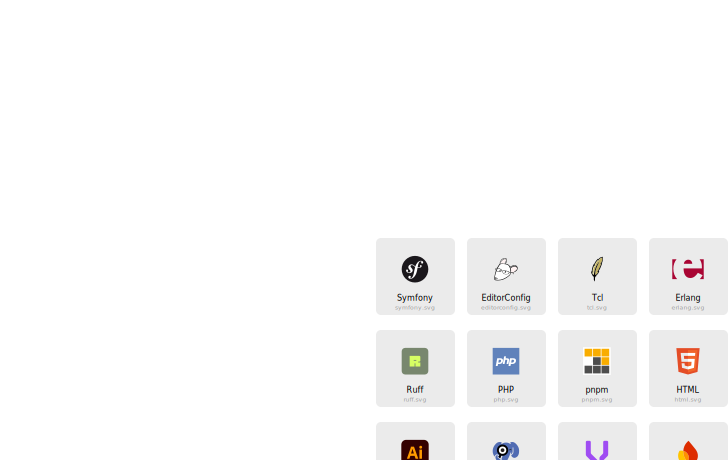

    

## OS

I am limited to test in macOS. Seems in Windows raises error unable to read when build preferences files. Same for Linux, I could not test it.

## Zukan Icon Theme

Icon theme for Sublime Text 4 editor.  

**Docs** ・ [Build](https://github.com/53v3n3d4/Zukan-Icon-Theme/blob/main/docs/build.md) ・ [File icon](https://github.com/53v3n3d4/Zukan-Icon-Theme/blob/main/docs/file-icon.md) ・ [Plugin](https://github.com/53v3n3d4/Zukan-Icon-Theme/blob/main/docs/plugin.md) ・ [Theme](https://github.com/53v3n3d4/Zukan-Icon-Theme/blob/main/docs/theme.md) ・ [Troubleshooting](https://github.com/53v3n3d4/Zukan-Icon-Theme/blob/main/docs/troubleshooting.md)

> File icons in v0.4.2  

> All file icons, see [file-icon.md](https://github.com/53v3n3d4/Zukan-Icon-Theme/blob/main/docs/file-icon.md)  

## Install

The recommended way to install is through [PackageControl.io](https://packagecontrol.io/packages/Zukan%20Icon%20Theme).  
- Menu `Tools > Command Palette > Package Control: Install Package`  
- Type `Zukan`, search for `Zukan Icon Theme`  
- Click to install it  
- Restart ST if installation do not prompt start, or all icons do not show in current theme.  

To install manually:  
- Download the [latest release](https://github.com/53v3n3d4/Zukan-Icon-Theme/releases) or clone this repo.  
- Menu `Sublime Text > Preferences > Browse packages...` to open destination folder  
- Then unzip `zukan-icon-theme zip file` inside `Packages` folder. Or clone the repo inside `Packages`folder.  
- Rename folder `Zukan-Icon-Theme` to `Zukan Icon Theme`. This is important for Main.sublime-menu and tests.  

> Mac/Linux `$ git clone https://github.com/53v3n3d4/Zukan-Icon-Theme.git Zukan\ Icon\ Theme`  
> Windows `$ git clone https://github.com/53v3n3d4/Zukan-Icon-Theme.git "Zukan Icon Theme"`  

> You may see a console message, regarding `ruamel-yaml` dependecy, when first install this package. ST may install it and inform that a restart is needed.  

> [`ruamel-yaml`](https://pypi.org/project/ruamel.yaml/) is being used to create icons sublime-syntaxes files in `icons-syntaxes` folder.  

If new install, the default is to create all icons files and make them show on all themes installed.  

### Theme

If you do not want icons in a specific theme. You can delete the icon theme, go to `Tools > Command Palette...`. Type `zukan` and select `Zukan Icon Theme: Delete Theme`.

This option deletes all icons preferences and syntaxes files. So when you move to a theme that you want icons, it will rebuild all files.

If you prefer to create or delete a theme manually, see [theme.md](https://github.com/53v3n3d4/Zukan-Icon-Theme/blob/main/docs/theme.md).  

## Uninstall

To remove package using Package Control.  
- Menu `Tools > Command Palette > Package Control: Remove Package`  
- Click on `Zukan Icon Theme`  

To uninstall manually, go to your Sublime Text folder.  
- Menu `Sublime Text > Preferences > Browse packages...`  
- Then delete `Zukan Icon Theme` inside `Packages` folder  

> Dependecies  

> ST4 uninstall orphans dependencies. So dependency [`ruamel-yaml`](https://pypi.org/project/ruamel.yaml/) should be deleted when you uninstall/remove package, if not used by other packages.  

## Upgrade

Package Control, by default, auto upgrade packages plugins. So this package will get icons PNGs and data file auto upgraded. Icons preferences and syntaxes are built based on user syntaxes and themes installed.  

We are auto upgrading icons preferences and syntaxes by default.  

You can disable it, go to menu `Sublime Text > Settings > Package Settings > Zukan Icon Theme > Settings` and change `rebuild_on_upgrade` to `false`.  

## Icons that do not work

- Favicon. ST use  `file_type_image` icon for binary files. `favicon.svg` works.  
- Photoshop. ST use `file_type_image` icon  
- XML. ST use `file_type_markup` icon  

## ST Package syntaxes that are using generic icon

- DTD use `file_type_markup`  
- XSL use `file_type_markup`  

## Troubleshooting

If icons not prompt show correct, restart ST may be the solution. See [troubleshooting.md](https://github.com/53v3n3d4/Zukan-Icon-Theme/blob/main/docs/troubleshooting.md)

## Notes
- This package uses tmPreferences and sublime-syntax files, it is heavily based on how [`A File Icon`](https://github.com/SublimeText/AFileIcon) package make icons work  
- `file-type-icons` is old project name  
- If rename `file-type-icons` to `v-file-type-icons`, and make the last folder in `Packages` directory, sublime icons will work  
- If rename `file-type-icons` to `z-file-type-icons`, and make the last folder in `Packages` directory, is not enough for svg icon to work. It was needed `zz-file-type-icons` to make svg icon work  

## Icons that works depending on folder position

- Poetry  
- SVG  
- sublime-theme, sublime-color-scheme, sublime-settings... mostly sublime (Exceptions like `hidden-theme` works not depending on this condition)  

## File icon packages :alien:

- [A File Icon](https://github.com/SublimeText/AFileIcon)  
- [FileIcons](https://github.com/braver/FileIcons)  

## License

MIT license ([LICENSE-MIT](LICENSE))  
